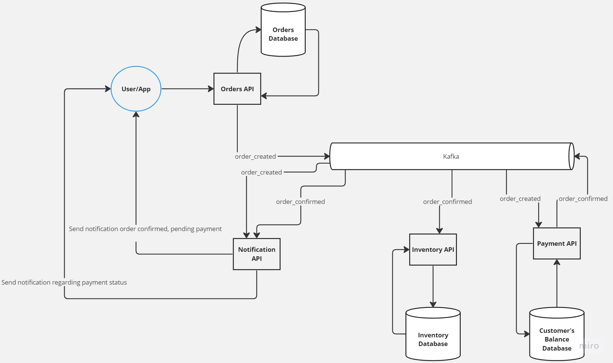

# kafka-microservices

- Order API: create orders with customerId, productId and amount. It has its own database
- Credit Card API: Contains customers' balances. Every time an order is confirmed, this API is charge of verify and process
  the payments. If the order price is higher than the current customer balance, the order is **rejected**. 
  It has its own database.
- Notifications API: communicate the user the state of the order, when is created, confirmed and paid.
- Inventory API: Decrease the current stock for the product in the order. It has its own database.
- Events: contains domain models and events common between all the microservices. 

## Architecture diagram

